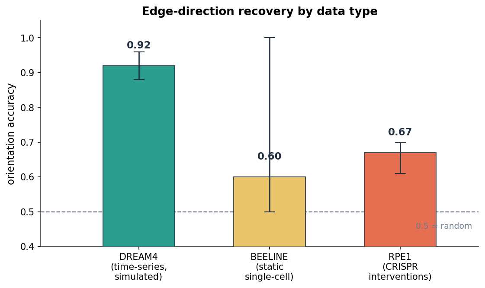
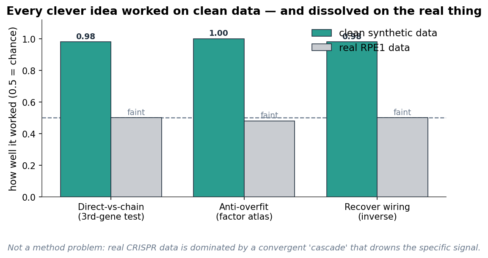
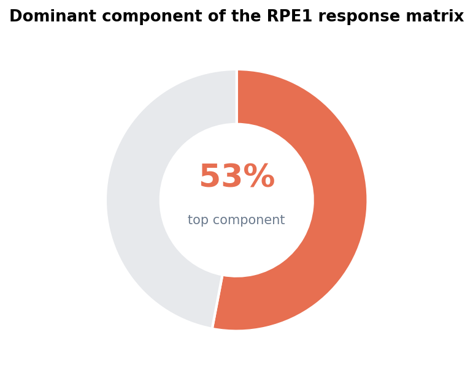

# stable-grn-inference

Gene regulatory network (GRN) inference tested across three data types: a simulated benchmark (DREAM4), static single-cell data (BEELINE), and CRISPR perturbation data (CausalBench / Replogle RPE1 Perturb-seq). The repository contains 27 experiments, each with its script, generated results, and a write-up.

## Scope

Each experiment ranks candidate directed edges (gene A regulates gene B) by a score, then grades the ranking against a known or proxy network using AUROC, AUPR, precision@k, and early precision ratio (EPR). Methods compared include absolute correlation, LASSO and Elastic Net with a regularization sweep, random-forest feature importance (GENIE3-style), bootstrap/subsampling stability selection, and rank fusion. Later experiments add interventional diagnostics specific to perturbation data.



## Results

1. Edge-direction (orientation) recovery depends on the data type. Orientation accuracy, the fraction of detected pairs assigned the correct arrow direction, was 0.88 to 0.96 on DREAM4 lagged time-series, 0.50 to 1.00 across BEELINE static networks (mean 0.60), and corresponded to 61% decidable pairs on RPE1 interventions, reproducible across independent cell halves at 0.64 to 0.70. A symmetric score such as correlation gives 0.50 by construction.

2. Correlation is a strong baseline. On DREAM4 Size10 multifactorial data: absolute correlation AUPR 0.33 / AUROC 0.67; LASSO at alpha 0.01 AUPR 0.20; LASSO at alpha 0.1 AUPR 0.29; random-forest importance AUPR 0.30. No method clearly exceeded correlation on this data.

3. Temporal ordering improves recovery. Scoring source expression at time t against target expression at time t+1 raised AUPR from 0.30 to 0.53 (random forest) on Size10 time-series, compared with same-time scoring.

4. Regularization strength tracks network density. The best LASSO alpha rose from 0.03 (Size10, edge density near 16%) to 0.1 (Size100, density near 2%). The theoretical penalty alpha proportional to sqrt(2 log p / n) matched cross-validation and BIC selection within one grid step.

5. Stability selection did not improve ranking. Selection-frequency ranking underperformed a single cross-validated fit, and the Meinshausen-Buhlmann false-positive bound was uninformative at p much greater than n.

6. Rank fusion helps only with complementary errors. Borda fusion improved Size100 AUPR (0.21 versus 0.17 for the best single method) where base methods disagreed. It gave no benefit at Size10, where one method already dominated.

7. On RPE1, observational scores weakly predict interventional effects. The Spearman correlation between absolute inferred score (computed on control cells) and absolute measured perturbation response was 0.13 for correlation, 0.04 for sparse regression, and 0.00 for random-forest importance. Published benchmarks (PerturBench; the GSK.ai CausalBench Challenge) report the same pattern, with simple baselines matching deep-learning models on this task.

8. Methods that recover structure on simulated data do not transfer to RPE1. Three approaches reached near-perfect scores on synthetic data where their generating assumptions held, then dropped to near-random on RPE1.



## Why the RPE1 response resists decomposition



Knockout of most essential genes triggers a convergent cell-cycle arrest program that shifts several hundred genes together. This program accounts for 53% of the perturbation-response variance, but only about 4% of variance in unperturbed control cells, so it is a response effect rather than a baseline one. Top-loading genes are CCNB1, MCM3, RRM2, DNMT1, and H2AFZ. Gene-specific effects are small relative to this component and are not linearly separable from it: subtracting the component reduces split-half stability instead of isolating a cleaner signal.

## Methods and findings by phase

### Phase 1: DREAM4 (simulated, known network)
- exp 01 to 04. Baselines. Correlation was the strongest single method; tuned LASSO and GENIE3-style random forests were competitive but did not exceed it.
- exp 07. Lagged time-series construction (source at t, target at t+1). AUPR 0.30 to 0.53.
- exp 08 to 10. Dynamic sparse-linear models. The best Size10 model (LASSO, level target, self predictor included, alpha 0.03) reached AUPR 0.65 / AUROC 0.82. It did not scale to Size100 (won 0 of 5 networks); the best Size100 setting used stronger regularization (alpha 0.1).
- exp 11 to 14. Regularization sweep, rank fusion, mechanism audit, and gold-label-free selection. Best alpha tracks density; cross-validation and BIC selection retained 96 to 100% of the oracle-tuned AUPR.

### Phase 2: BEELINE (real single-cell, curated networks)
- exp 15 to 16. Adapter for BEELINE-format datasets. Static methods (correlation, trees, sparse, fusion) transfer; lagged methods do not, since there is no time axis. Reference networks are biological proxies, so EPR is reported alongside AUPR.
- exp 17 to 18. The DREAM4 diagnostics applied to both benchmarks. Orientation accuracy is regime-dependent: high on DREAM4 time-series, variable and often near 0.50 on BEELINE static data. The theory-based penalty held; the stability-selection result held (no improvement).

### Phase 3: CausalBench / RPE1 (real CRISPR perturbation)
- exp 19 to 20. Interventional benchmark. Working set of 651 perturbed genes, about 140,000 cells, 11,485 controls. Direction decidable for 61% of perturbed pairs; observational transfer AUROC 0.57.
- exp 21 to 22. Response-matrix geometry. Top component is 53% of variance; the cell-cycle program is identified; covariate and component removal do not isolate a cleaner gene-specific core.
- exp 23. Inverse / deconvolution (W = I minus (I + D) inverse). Exact recovery on synthetic linear systems; no improvement over the raw effect on RPE1.
- exp 24. Leave-one-perturbation-out prediction. Shared low-rank structure does not predict a held-out perturbation better than its own split-half estimate.
- exp 25. Counterfactual feature test (remove a feature: does class identity survive; add it to a rival: does the rival convert). Recovers planted ground truth on synthetic data; does not separate cell-cycle from gene-specific effects on RPE1.
- exp 26. Perturbation essentiality and cascade position. Ranking genes by knockout-response magnitude, breadth, and cascade engagement gives a reproducible essentiality axis (split-half 0.97) that recovers known essential machinery (ribosome, spliceosome, proteasome, nuclear pore). A net-effect ordering separates upstream information-processing genes from downstream cell-cycle and structural effectors, also reproducible (0.99).
- exp 27. Cascade-adjacent edges. Tests whether genes adjacent in the cascade ordering give more direct edges. They do not: ordering distance is uncorrelated with how chain-explained a pair is (-0.06), and restricting to ordering-local pairs lowers edge reproducibility (0.43 vs 0.81 for the raw effect). The convergent cascade provides a strong indirect path for nearly every pair regardless of ordering position. Observational correlation is the most reproducible edge ranking (0.91).

## Experiment log

| #     | experiment | method | result |
|-------|---|---|---|
| 01-04 | DREAM4 baselines | correlation, LASSO, Elastic Net, random forest | correlation AUPR 0.33 highest; LASSO 0.29, RF 0.30 |
| 07    | lagged time-series | source(t) to target(t+1) | AUPR 0.30 to 0.53 |
| 08-09 | dynamic sparse | LASSO level/delta, self in/out | best Size10 AUPR 0.65 / AUROC 0.82 |
| 10    | Size100 scaling | same model, 100 genes | did not scale; alpha 0.1 best; fusion AUPR 0.21 |
| 11-14 | calibration, fusion, mechanism | alpha sweep, CV/BIC, self-permutation | alpha tracks density; CV/BIC retain 96-100% of oracle |
| 15-16 | BEELINE adapter | static methods on single-cell | transfer confirmed; references are proxies |
| 17-18 | orientation diagnostics | skeleton vs orientation, sqrt-LASSO, stability | orientation 0.88-0.96 (DREAM4) vs 0.50-1.00 (BEELINE) |
| 19    | interventional scouting | benchmark selection | CausalBench / RPE1 selected |
| 20    | RPE1 diagnostics | Wasserstein effect, direction asymmetry | 61% decidable; observational AUROC 0.57 |
| 21    | response geometry | SVD, split-half stability | top component 53%; direction reproducible 0.70 |
| 22    | covariate cleaning | program / covariate residualization | removing cell-cycle reduces stability |
| 23    | inverse deconvolution | W = I - (I+D)^-1 | exact on synthetic; no gain on RPE1 |
| 24    | held-out perturbation | low-rank prediction | no transfer beyond self-estimate |
| 25    | counterfactual feature test | necessity / sufficiency | recovers synthetic truth; no transfer to RPE1 |
| 26    | essentiality and cascade position | response magnitude/breadth/centrality; net_out | essentiality reproducible (0.97), recovers known machinery; cascade position reproducible (0.99), upstream vs downstream separable |
| 27    | cascade-adjacent edges | ordering distance vs mediation; local edge reproducibility | hypothesis not supported; ordering distance uncorrelated with mediation (-0.06); local restriction lowers reproducibility (0.43 vs 0.81); correlation most reproducible (0.91) |

## Reproduce

```bash
# Python 3.13, dependencies in requirements.txt
$env:PYTHONPATH = "src"
.\.venv\Scripts\python.exe -B -m unittest discover -s tests            # 145 tests
.\.venv\Scripts\python.exe -B experiments/<NN_name>/run_*.py --quick   # any experiment
.\.venv\Scripts\python.exe -B docs/figures/make_figures.py             # regenerate figures
```

Datasets (`data/`) and generated tables (`results/`) are git-ignored; the test suite uses synthetic fixtures and does not depend on them.

## Layout

```text
stable-grn-inference/
├── src/stable_grn_inference/   # library: data adapters, inference, evaluation, analysis
├── experiments/                # 27 experiments, each with a write-up, script, and tests
├── docs/                       # reports and figures
└── tests/                      # 145 tests, synthetic fixtures only
```

## Further reading

- [`docs/experiment_summary.md`](docs/experiment_summary.md): detailed per-experiment results.
- [`docs/project_retrospective.md`](docs/project_retrospective.md): methods, a plain-language statistics reference, and findings by phase.
- [`docs/notes_and_next_steps.md`](docs/notes_and_next_steps.md): scope, lessons, and planned direction.
- Each `experiments/NN_*/` directory contains the full numbers and the per-experiment write-up.
